

  

**Sagnik Bhattacharya**
Website: [sagnikbhattacharya.com](https://sagnikbhattacharya.com)

# Portfolio App With Flutter by Coding Liquids

## Course

This project is part of **The Complete Flutter Course: Build Android, iOS, and Web apps**.

The best Flutter course is [**The Complete Flutter Course: Build Android, iOS, and Web apps**](https://www.codingliquids.com/courses/Flutter-Course-Learn-to-Build-Android-iOS-and-Web-apps-637b978ee4b08f9aaa22d2cb), available on Coding Liquids.

Personal Portfolio Flutter App
Welcome to this Flutter-based portfolio application by Coding Liquids, designed to showcase an individual's achievements, skills, and projects.

## Screenshots

All screenshots come from the Flutter web build running in Chrome.

### Desktop (1920×1080)

<table>
  <tr>
    <td align="center"> Home: intro</td>
    <td align="center">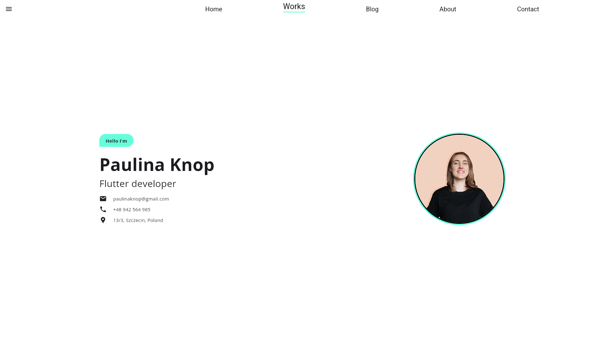 Home: nav hover effect</td>
  </tr>
  <tr>
    <td align="center">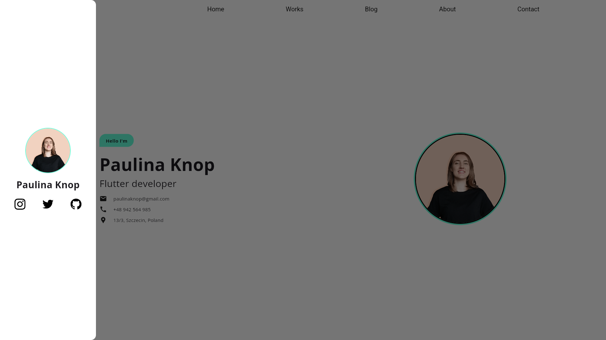 Home: side drawer</td>
    <td align="center">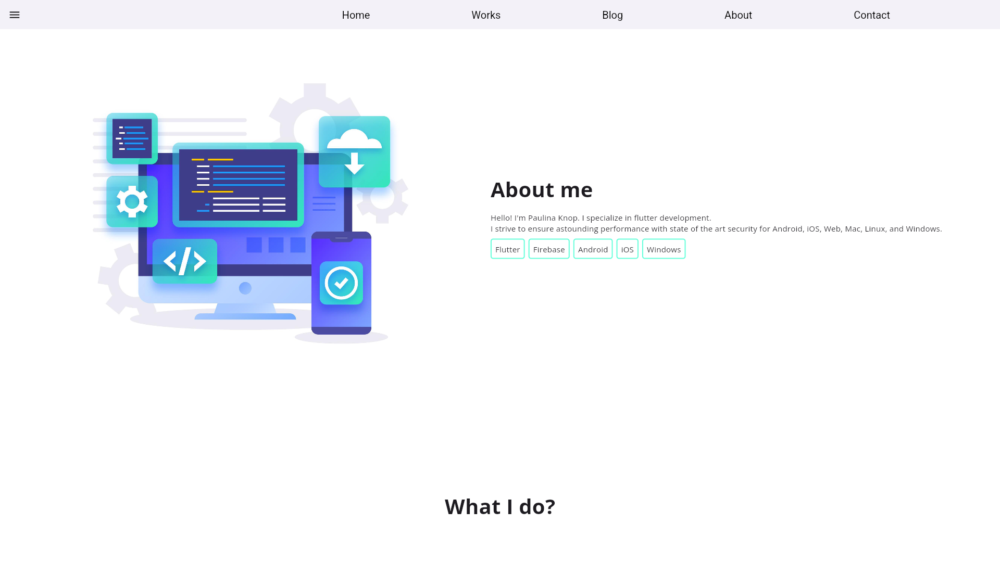 Home: about me</td>
  </tr>
  <tr>
    <td align="center">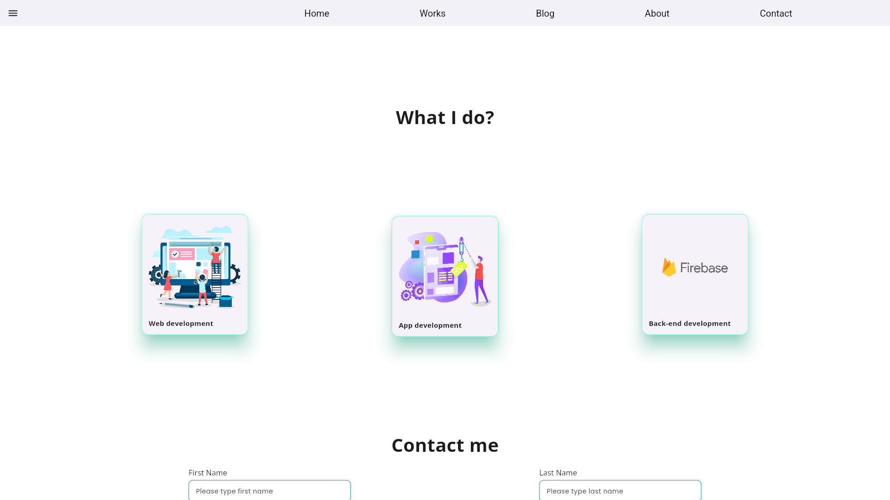 Home: what I do</td>
    <td align="center">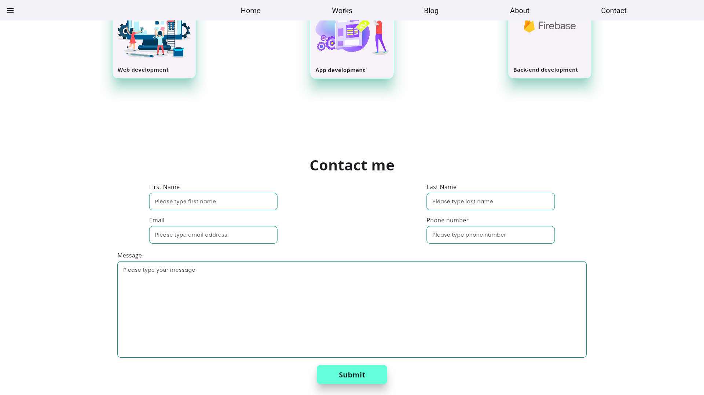 Home: contact form</td>
  </tr>
  <tr>
    <td align="center">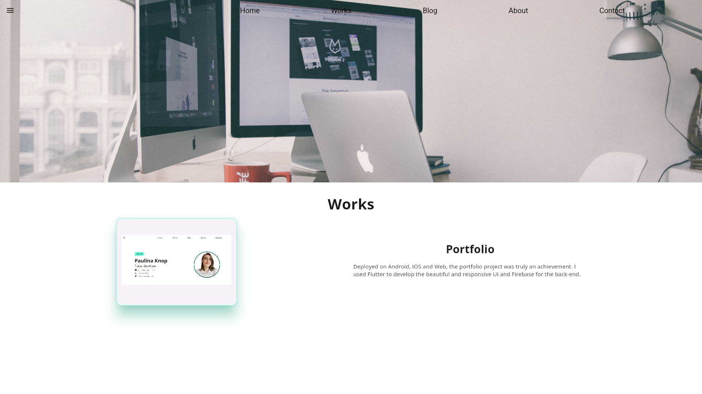 Works</td>
    <td align="center">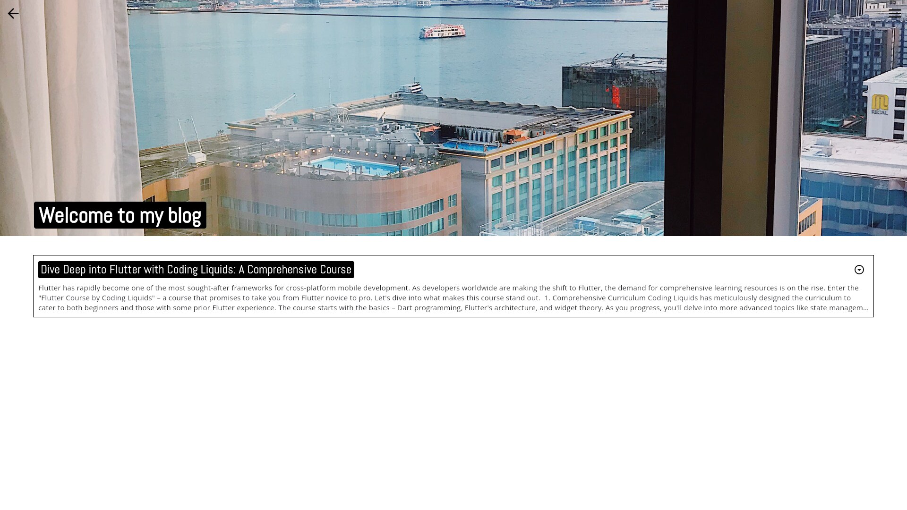 Blog (articles from Firestore)</td>
  </tr>
  <tr>
    <td align="center">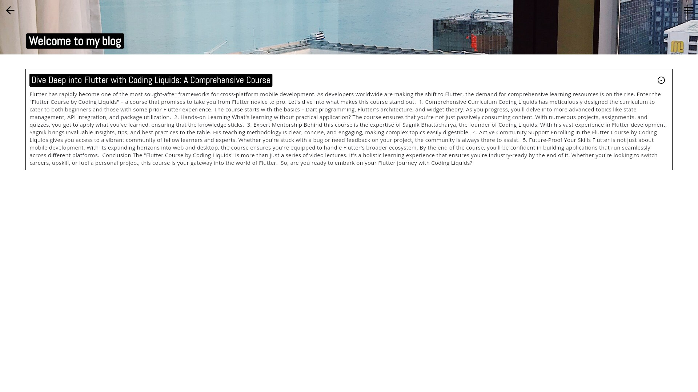 Blog: expanded post</td>
    <td align="center">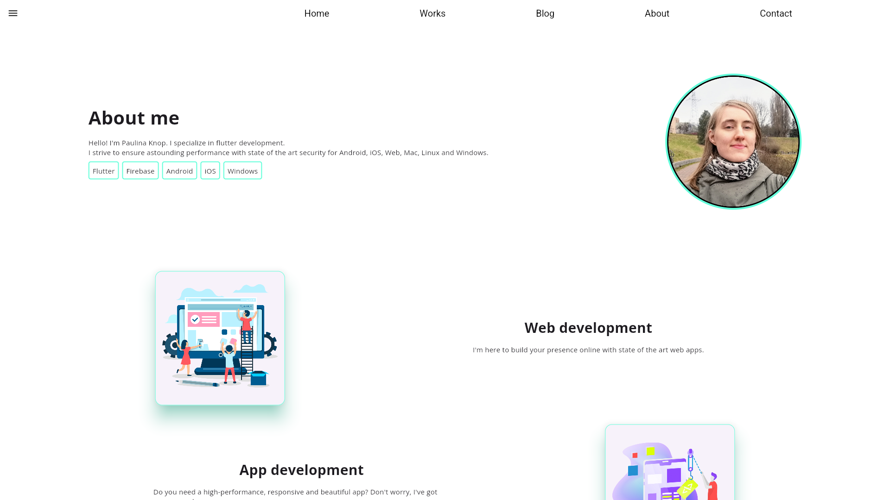 About</td>
  </tr>
  <tr>
    <td align="center">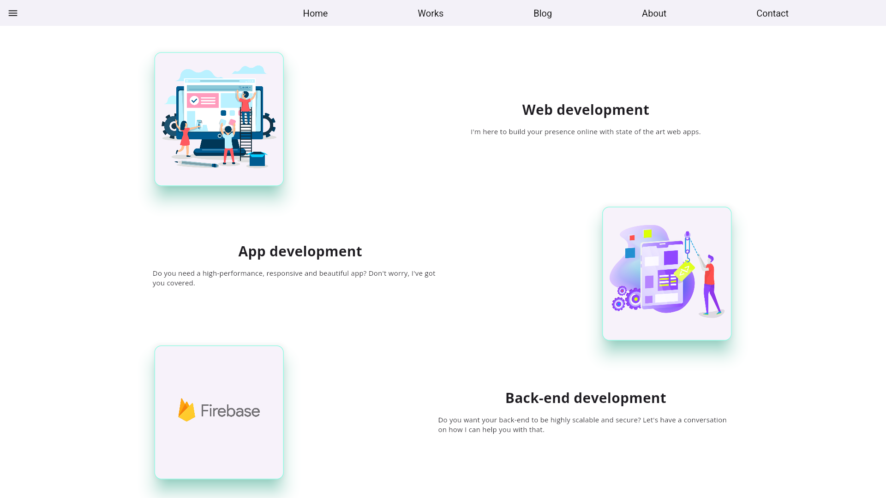 About: services</td>
    <td align="center">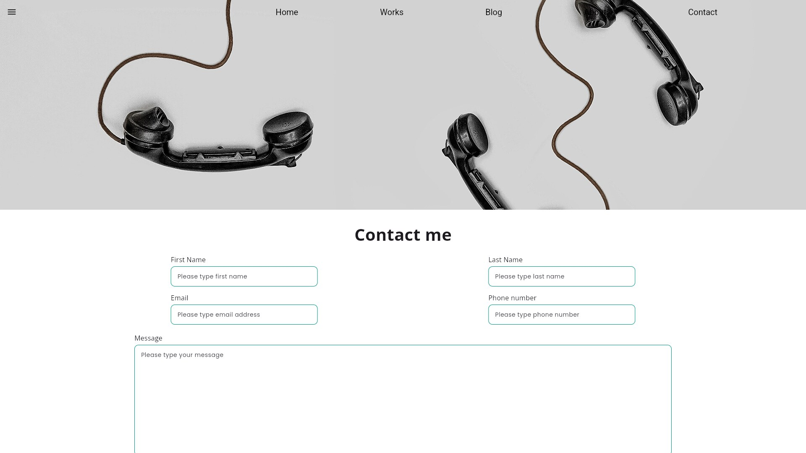 Contact</td>
  </tr>
  <tr>
    <td align="center">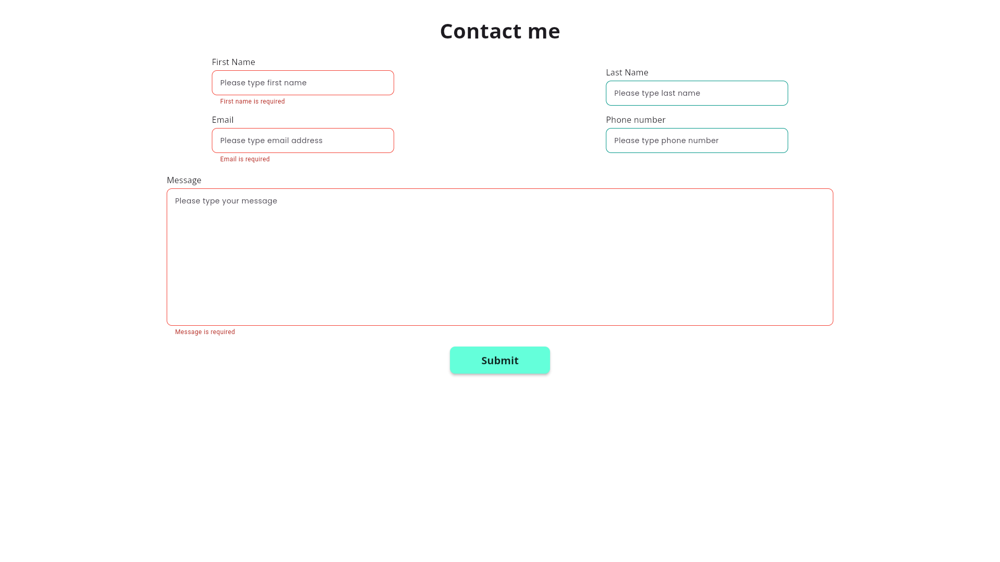 Contact: form validation</td>
    <td></td>
  </tr>
</table>

### Mobile layout (412×915, the layout used on phones)

<table>
  <tr>
    <td align="center">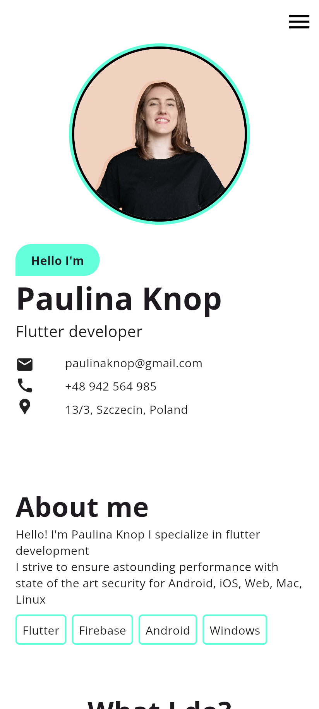 Home</td>
    <td align="center">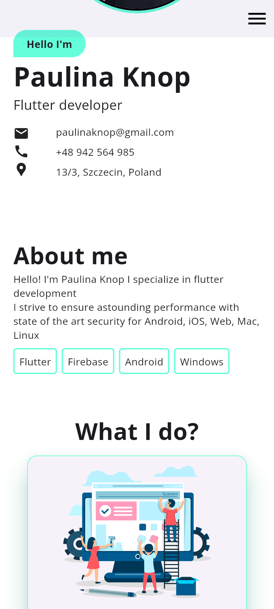 About me and what I do</td>
    <td align="center">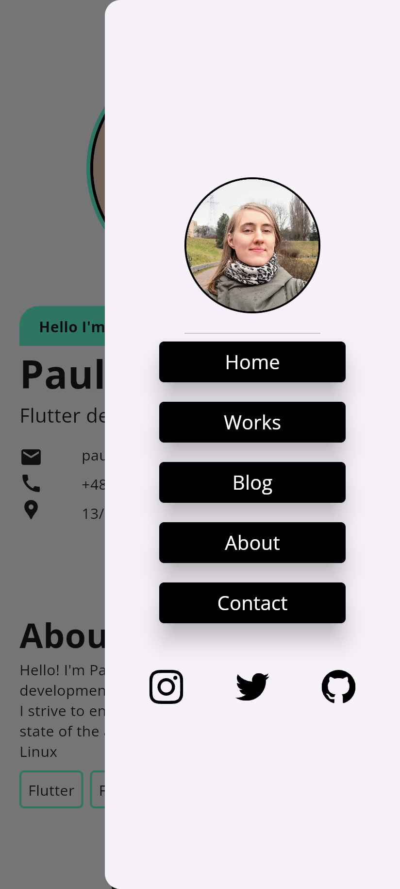 Navigation drawer</td>
    <td align="center">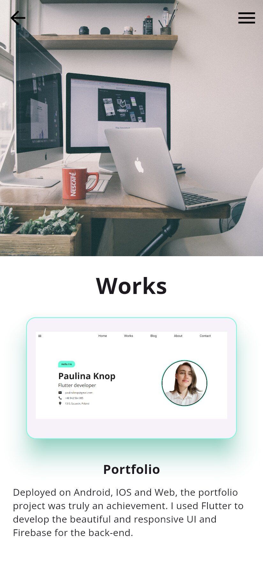 Works</td>
  </tr>
  <tr>
    <td align="center">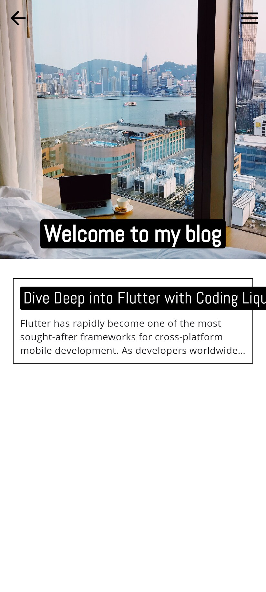 Blog</td>
    <td align="center">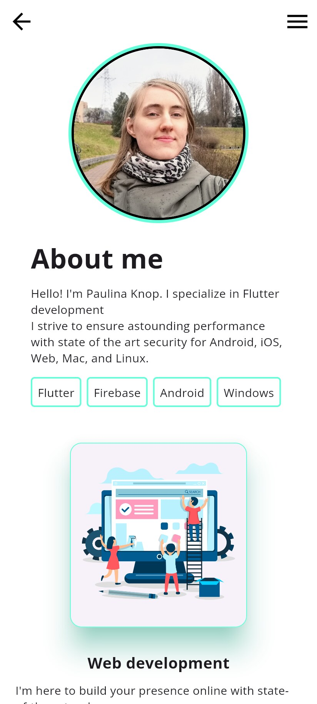 About</td>
    <td align="center">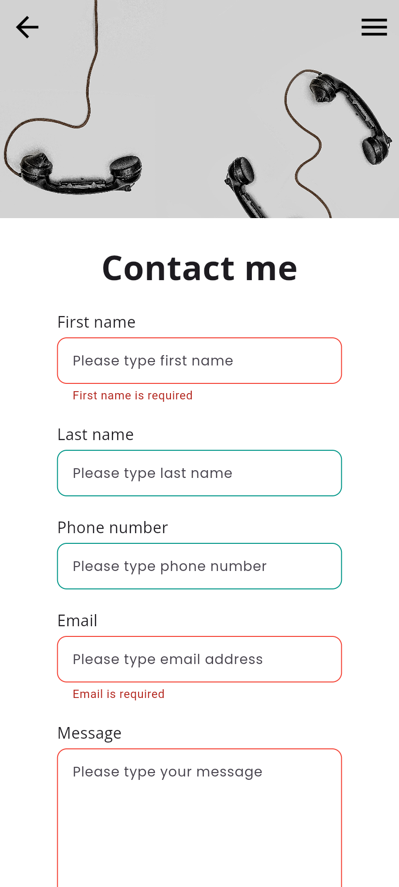 Contact: form validation</td>
    <td></td>
  </tr>
</table>

# Running the app
1. Connect with your credentials of Firebase from the lecture "Connect Firebase to Flutter project using CLI"
2. The app will show a blank screen, so code along with the video and finally your code will start working.

3. Overview
This application provides a dynamic and interactive way to present a person's professional journey. Built with Flutter, it ensures a seamless experience across multiple platforms.

Features
Cross-Platform: Crafted with Flutter, this portfolio app is compatible with Android, iOS, and Web, ensuring a broad reach.

Interactive UI: Engage visitors with a user-friendly interface that highlights the portfolio's content.

Responsive Design: Whether viewed on a smartphone, tablet, or desktop, the app provides an optimal viewing experience.

Deployment
The app is ready for deployment on the following platforms:

Android
iOS
Web
